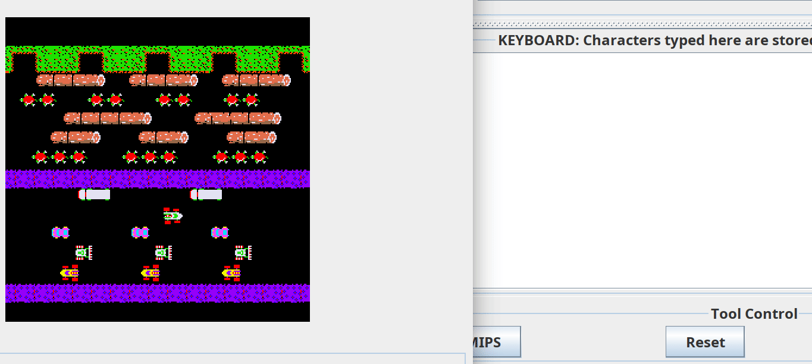

# CSC258
Course Achieves for UofT CSC258 2021W

# *Consider if you can handle Academic Offence before copying my code for csc258*
## Final project: Assembly frogger

See here for a better implementation:

<https://github.com/Mondlicht1/Frogger>

